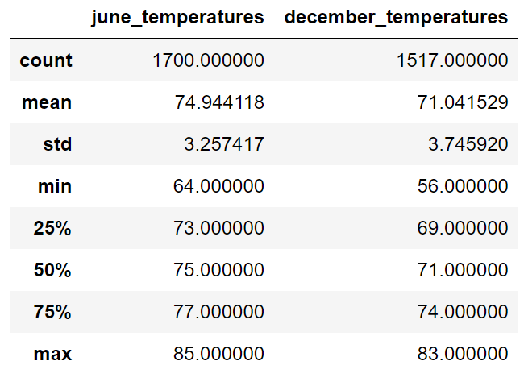
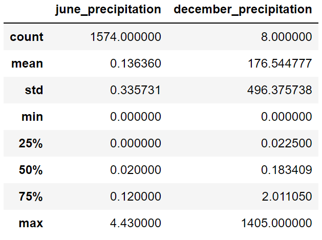

# surfs_up

## Overview of the statistical analysis

### Purpose of the analysis

The purpose of the analysis is to determine if the surf and ice cream shop business is sustainable year-round by providing more information about temperature trends for the months of June and December in Oahu.

## Results

### Bulleted list that addresses the key differences in weather between June and December

* There are 12% more data points for June than December
* June was on average about 4 degrees warmer than December
* The minimum temperature for December was 8 degrees colder than June
* The maximum temperature for June was 2 degrees warmer than December
* The IQR for December was 1 degree larger than the IQR of June

## Summary:

### High-level summary of the results

Temperatures queried for the months of June and December were compared.

### Additional queries to perform to gather more weather data for June and December

Extracting descriptive statistics for precipitation in the month of June:
`pd.DataFrame({"june_precipitation": [t[0] for t in engine.execute('SELECT prcp FROM measurement WHERE date LIKE "%-06-%"').fetchall()]}).describe()`

Extracting descriptive statistics for precipitation in the month of June:
`pd.DataFrame({"december_precipitation": [t[0] for t in engine.execute('SELECT prcp FROM measurement WHERE date LIKE "%-12-%"').fetchall()]}).describe()`

